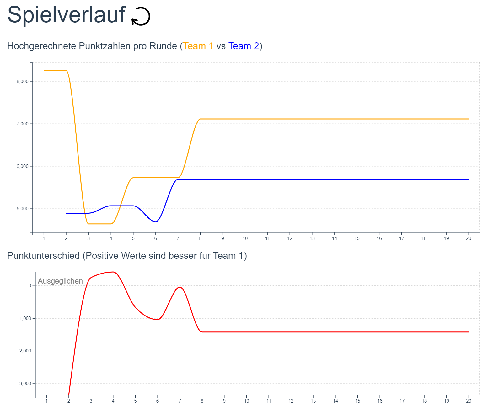

# JassTracker
[](https://github.com/PascalHonegger/JassTracker/actions/workflows/backend.yml)
[](https://github.com/PascalHonegger/JassTracker/actions/workflows/frontend.yml)
[](https://github.com/PascalHonegger/JassTracker/actions/workflows/documentation.yml)
[](https://github.com/PascalHonegger/JassTracker/actions/workflows/operations.yml)

## Screenshots




## Development

The easiest way to start all components is using the configured IntelliJ run configuration.
There exists one configuration for `Frontend`, `Backend` and `Postgres Dev`, or you can start all using the `All Dev` configuration.
You can also manually start all components:

### Frontend
```shell
cd Frontend
# Install NPM dependencies
npm ci
# Start dev server
npm run serve
# Build for prod
npm run build
# Run linter
npm run lint
```

### Backend
```shell
# Start dev server
./gradlew run
# Run tests
./gradlew check
```

## Deployment / Production

```shell
# See docker-compose.yml for prod template
docker compose up -d
```

## Documentation

This repository is configured to be usable within VS Code, using the LaTeX Workshop plugin.

The included makefile can be used via the `make doc` command within the `Documentation` directory to build the pdf version of the documentation. The `make doc_diff` command can be used to generate the diff pdf via latexdiff. Make sure that you tag the base version you want to use for the diff with the `latexdiff-base` tag in the repository. Take a look at `Documentation/makefile` for more information.

The repository has also been configured to automatically build `Documentaton/out/main.pdf` and `Documentation/out/diff.pdf` upon every push onto gitlab. These can be found within `CI/CD -> Jobs -> Artifacts`. Take a look at `.gitlab-ci.yml` for more information.
